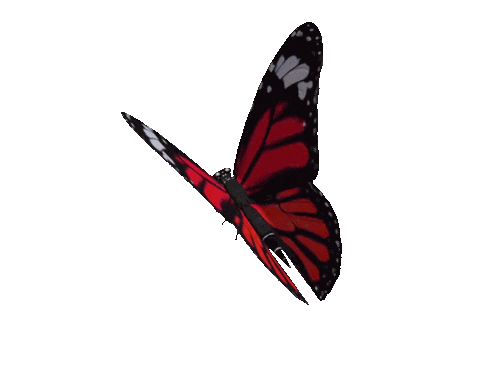

  <strong>
    a touch of whimsy, and a little bit of stem
  </strong>

Electrical Engineering @ UCalgary  
    embedded systems • firmware • hardware

 

---

## ⚙️ tech stack

<table>
<tr>
<td width="1000" align="center">

### 🧠 languages

### 🔌 embedded / hardware

### 🛠 tools

</td>
</tr>
</table>

### 🎧 currently
off from school, perchance building something (☞ ͡° ͜ʖ ͡°)☞

