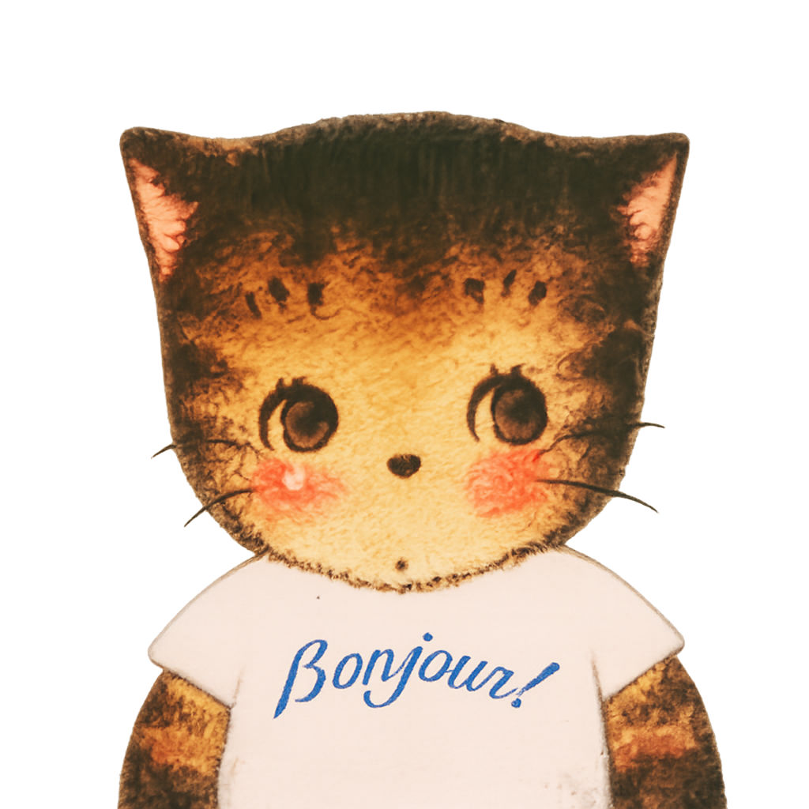

<h1 align="center">a touch of whimsy, and a little bit of stem</h1>

Electrical Engineering @ UCalgary  
embedded systems • firmware • hardware

---

<table width="100%">
<tr>
<td valign="middle" width="70%">

### 🧠 languages

### 🔌 embedded / hardware

### 🛠 tools

</td>
<td align="center" valign="middle" width="30%">

</td>
</tr>
</table>

---

## 🚧 current builds
- rc car with bluetooth + ultrasonic sensing  
- midi visualizer (nRF52840 + zephyr + lvgl)  
- experimenting with audio + displays + embedded systems  

---

## 🎧 currently
off from school, perchance building something (☞ ͡° ͜ʖ ͡°)☞ 

---

## 🧩 a little more
- kendrick lamar enthusiast, along with other wonderful artists
- ex gym bro
- maybe i do sing, exploring a rap career
- but of course i love the chaos of hardware and creativity 
