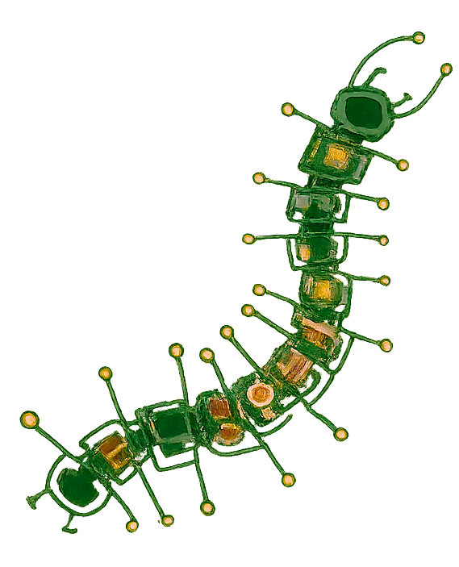

  

  

  

    <strong><em>𝖼𝗁𝗎𝖽𝖽𝗂𝗇𝗀 𝖺𝗐𝖺𝗒 𝖺𝗇𝖽 𝗍𝗂𝗇𝗄𝖾𝗋𝗂𝗇𝗀 𝖺𝗍 𝗆𝗒 𝖽𝖾𝗌𝗄 .... ༻*ੈ✩‧₊˚</em></strong>
    
      
    🇪🇱🇪🇨🇹🇷🇮🇨🇦🇱 🇪🇳🇬🇮🇳🇪🇪🇷🇮🇳🇬 @ 🇺🇨🇦🇱🇬🇦🇷🇾
     
    embedded systems • control systems • low-level IC.
     
    ૮₍ ´ ꒳ `₎ა
  

  
 

## ⚙️ tech stack

  

  
  
  

### 🎧 currently

off from school, perchance building something (☞ ͡° ͜ʖ ͡°)☞
